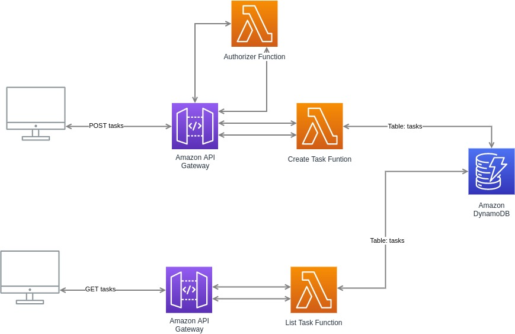

# Tasks Service

This project implement a task service. You can add task specifying a title for it, and you can list all the task registered.

## Code Organization
Individual code is organized as follows:

* create-task/main.go - function to handle POST method for creating a new task
* list-task/main.go - function to handle GET method for retrieving list of saved tasks
* authorize/main.go - function to authorize users to create a task
* task-data.go - DAO wrapper around the DynamoDB calls to store tasks
* Makefile - Used for compiles of individual functions
* serverless.yml - Defines the initial table, function defs, and API Gateway events


## Set Up
In order to set up end deploy the project you need Serverless Framework, [follow the installation instructions here](https://www.serverless.com/framework/docs/getting-started), and You'll also need to [install Go](https://golang.org/doc/install).
The project use Go modules so is no require to install any dep manager.

When both of those tasks are done clone this project into your local folder.  Then cd into the resulting `tasks-service` folder and compile the source with `make`:

```
make
```

The make compile the code and prepare the code for deploy.

In order to deploy the project to AWS it requires authentication. This project use AWS profile authentication.

Create [Access Keys](https://www.serverless.com/framework/docs/providers/aws/guide/credentials#creating-aws-access-keys) and then configure the profile with name `serverless-admin` with aws-cli ([install it](https://docs.aws.amazon.com/cli/latest/userguide/cli-chap-getting-started.html))

When you have your profile setted up you can deploy the project:
```
serverless deploy
```

When done, you can find the `tasks` DynamoDB table in the AWS Console
and your `<base URL>` will be of the format 'https://XXXXXXXXXX.execute-api.us-east-1.amazonaws.com/dev/tasks' where `XXXXXXXXXX` will be some random string generated by AWS.

## Using
Once deployed and substituting your `<base URL>` the following CURL commands can be used to interact with the resulting API

### POST create a new Task

The task creation require to be authenticated.  You need to provide a Bearer token with string `authorize`

```
curl --request POST \
  --url https://<base URL>/dev/tasks \
  --header 'Authorization: Bearer authorize' \
  --header 'Content-Type: application/json' \
  --data '{
	"title":"Fisrst Task"
}'

curl --request POST \
  --url https://<base URL>/dev/tasks \
  --header 'Authorization: Bearer authorize' \
  --header 'Content-Type: application/json' \
  --data '{
	"title":"Second Task"
}'
```

Which should create a new task and insert it in the DynamoDB table.


### GET a List of Tasks
You can list tasks as follows:
```
curl https://<base URL>/tasks
```
the output will be:
```
[
  {
    "title": "First Task",
  },
  {
    "title": "Second Task",
    }
  }
]
```

## Architecture
This project use Lambda Function to handle tasks creation and tasks listing.
The tasks are stored inside a Dynamo Db table, so they could be available for all the lambda functions.
The API are exposed though AWS API Gateway that use AWS Lambda to handle requests



## TODOS

There are many improvement that we could make to the project:

- Send Logs to Elasticsearch -> actually there is no solution to do that over serverless framework yet. The idea is to use Log Stream to send Lambda Function Logs from CloudWatch to Elasticsearch.
- Allow adding additional info to the tasks
- Allow deleting a Task
- Add Unit Test for Lambda functions
- Improve authentication
- User should be able to create personal task list.
